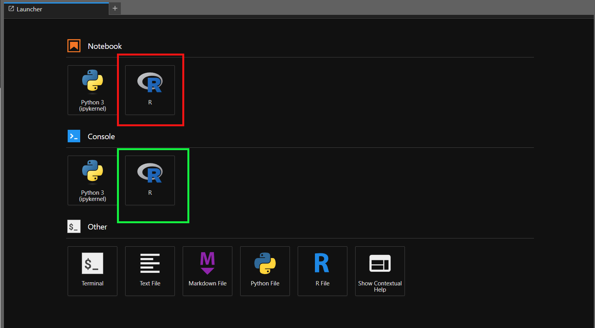

# Jupyter Notebook with Spark tutorial

***Note: Some images may differ from actual JupyterHub, but in the functionality in the images does not differ.***

### Your credentials

SSH into `spark-edge`.Your credentails are saved under `login.txt` file on ypur `spark-edge` server home. Do `cat login.txt` to get the credentails.

Your hawk id username is your username and random string of letters is your password.

To access your `spark-edge`:
1. Connect the school VPN visit https://vpn.iit.edu and download the university VPN (cisco) software (watch out your will have to authenticate via your second factor).
2. Connect to the host `vpn.iit.edu` in the vpn client.
3. Connect via SSH
    This is the example syntax
    `ssh -i "~\.ssh\id_ed25519_spark_edge_key" hajek@system26.rice.iit.edu`


> **Note: You only need to SSH into your `spark-edge` once to get the credentials.You can store this credentails some where safe as you can access the terminal inside the JupyterHub itself.**
### Login

#### Connecting to VPN:
1. Connect the school VPN visit https://vpn.iit.edu and download the university VPN (cisco) software (watch out your will have to authenticate via your second factor).
2. Connect to the host `vpn.iit.edu` in the vpn client.
**You need to be on the ***VPN*** to access any resources related to the cluster.**

Go to the link `http://192.168.172.26:8000/` and sign in  with your username and password.


### Creating a Notebook
Once you are logged in, you will see a page like this:


This is called **Launcher**.The left pane is the File Browser, it is the area where you will see all you files and folders present in your account. You can make use of ***New Folder (Green arrow)***, ***Upload Files (Red arrow)*** buttons situated right below ***Run Menu*** as shown in below image.


Click on the button pointed by Black arrow to navigate to your ***Home Directory***.

Click on python icon under the Notebook section to create a new notebook. 


If you want to create a new Notebook with R kernel you can click on **R** logo under notebook this will create a notebook with R kernel, same goes for R console.




This will create a new notebook in the ***current directory***. If you want to create a new notebook in specific directory, navigate to that folder and then click on python icon under notbook section as shown above.


### Running programs

Once you have created a notebook, you can run your python and **R** programs. You can run a cell by clicking on the play button on the top menu of the notebook as shown below.


You can access launcher again by clicking on **"+"**.


### Restarting Kernel

There two ways to restart the kernel shown in the below images.
1. By clicking on restart icon present at the top of the notebook.

    

2. By going to kernel menu

    

3. Alternative to the above you can click on icon shown below to restart the kernel and run all cells of the notebook.

    

### Terminal

In the launcher click on ***Terminal*** in the ***other*** section.


This is like any other linux terminal, you can do everything that your normal profile terminal allows you to do.

The main use of this section in this case is to ***clone and manage GitHub Repo's***. Clone your repository via ssh using `git clone`,if not already cloned

For more information on cloning your repo [click here](https://github.com/illinoistech-itm/jhajek/tree/master/itmd-521/git-tutorial).

### Installing Python libraries

The jupyter notebook generated is like any other jupyter notebook, you can install any extenal libraries with `pip`. Example:

```
pip install pandas
```
> **Note:** Only spark jobs will be sent to the spark cluster, any code other than spark will be run on local compute.

### Extensions
You can also install extensions and add it to your workspace.
You can install extensions by clicking on the extensions tab in the left manu pane and then search your desired extension and click on intsall.


> **Note:** Not all extensions are supported as some extensions may require server side configuration or specific version of jupyter hub and its associated libraries. 

### Restarting Jupyter Server

You can restart the jupyter server by clicking on the hub control panel present in file menu and then click on Stop my server and start my server.


 


## Running Spark Jobs

### Creating a Spark Session 

Access Spark Web UI @ http://system88.rice.iit.edu/

Access MinIO @ https://system54.rice.iit.edu/minio/ui/browser


Run the below snippet of code in a cell to create a spark session on the spark master with connection to the Minio Bucket.

```R
library(SparkR, lib.loc = c(file.path("/usr/bin/spark", "R", "lib")))
creds_file <- "creds.txt"  
if (file.exists(creds_file)) {
  creds <- readLines(creds_file)
  credentials <- strsplit(creds, ",")[[1]]
  accesskey <- credentials[1]
  secretkey <- credentials[2]
} else {
  stop("File not found.")
}
sparkR.session(
    sparkPackages = "org.apache.hadoop:hadoop-aws:3.2.3",
    sparkConfig = list(
  "spark.hadoop.fs.s3a.aws.credentials.provider" = "org.apache.hadoop.fs.s3a.SimpleAWSCredentialsProvider",
  "spark.hadoop.fs.s3a.access.key" = accesskey,
  "spark.hadoop.fs.s3a.secret.key" = secretkey,
  "spark.hadoop.fs.s3a.path.style.access" = "true",
  "spark.hadoop.fs.s3a.impl" = "org.apache.hadoop.fs.s3a.S3AFileSystem",
  "spark.hadoop.fs.s3a.endpoint" = "http://system54.rice.iit.edu",
  "spark.hadoop.fs.s3a.committer.magic.enabled" = "true",
  "spark.hadoop.fs.s3a.committer.name" = "magic",
  "spark.master" = "spark://sm.service.consul:7077",
  "spark.driver.memory" = "8g",
  "spark.executor.memory" = "4g",
  "spark.cores.max" = "10",
  "spark.executor.cores" = "1",
  "spark.driver.host" = "spark-edge.service.consul"
    
  )
)
```
The above code will create a new spark session with the configurations required to connect to S3 bucket. You can add your own configurations to the list as shown.

This configuration `"spark.master" = "spark://sm.service.consul:7077"` is the one that sends the jobs to the cluster, without this line the spark job will run on local compute.

The configurations `"spark.driver.memory" = "8g","spark.executor.memory" = "4g"` are the ones that set the driver and executor memory.

**Driver Memory**: Think of the driver as the "brain" behind your Spark application. Its role is to manage and coordinate the entire job. The driver memory refers to the memory assigned to the driver process, which is responsible for tasks such as creating execution plans, tracking data, and gathering results.

- Impact: If the driver memory is too low, it might run out of memory, causing your Spark application to fail. If it's too high, it may lead to inefficient memory usage and affect the performance of other processes running on the same machine.

The driver memory should be higher when:

- Your Spark application involves complex and resource-intensive tasks that require significant memory for execution planning and management.
The driver needs to store intermediate data structures or collect a large amount of data from executors.

The driver memory should be lower when:

- Your Spark application is simple and has minimal coordination or collection tasks.
The driver performs lightweight operations, and the primary computational tasks are executed in the executors.

**Executor Memory**: Think of the executor as the "worker bees" of your Spark application. Executors are responsible for performing the actual data processing and computation tasks. Executor memory is the amount of memory allocated to each executor process to store intermediate data, cached data, and execution buffers.

- Impact: If the executor memory is too low, it may lead to frequent data spilling onto the disk, which slows down processing. If it's too high, it can cause resource contention with other processes on the cluster and affect overall application performance.

The executor's memory should be higher when:

- Your Spark application processes large-scale datasets that require substantial memory for intermediate results and execution buffers.
Complex transformations or aggregations are performed, which involve data shuffling and storage.

The executor's memory should be lower when:

- Your Spark application processes smaller datasets that do not require a large memory footprint for intermediate data or execution buffers.
The computational tasks are relatively simple, and there is no need for a significant amount of memory for data processing.

In Summary:

Driver Memory is responsible for managing the overall job and result collection.
Executor Memory performs the actual data processing tasks on distributed data.

Article [source](https://www.linkedin.com/pulse/roles-driver-memory-executor-spark-impact-big-data-processing-dip/) for driver and executor memory.

Since, we are not lauching our session from the user terminal the notebook does not have access to the environment variables present in user's `.bashrc`. So, in order to get around this and not to hard code the passwords, the below block of code is used.

```R
if (file.exists(creds_file)) {
  creds <- readLines(creds_file)
  credentials <- strsplit(creds, ",")[[1]]
  accesskey <- credentials[1]
  secretkey <- credentials[2]
} else {
  stop("File not found.")
}
```

In the `try` block we are trying to open the `creds.txt` file that's present in the user's home folder and read the contents of it into two varibales `accesskey` and `secretkey` these variables are then used in S3 auth configuration.

Now, you can make use of the `SparkSession` object created in this case `spark`, in the forthcoming cells to run the spark jobs.

Once you create a session spark master will ***treat it as a job and assigns resources***. You need to stop the session as shown below to create a new session or once your job is completed.

```python
sparkR.session.stop()
```
**It is recommended that you restart the kernel once you stop the session before starting a new session by clicking restart kernel situtated right of stop button (or) from kernel menu, as it clears all the cached variables.**

### Logs

The default log level is "WARN".If you want more clearer logs as seen in terminal, then after creating the session run the below lines in a new cell.

```python
sc = spark.sparkContext
sc.setLogLevel("INFO")
```

### Reading From MinIO

The below code snipped is a sample pyspark code that the will read csv file 50.txt and do some transformations stored as splitDF

```python
from pyspark.sql.types import *
from pyspark.sql.functions import *


df = spark.read.csv('s3a://itmd521/50.txt')

splitDF = df.withColumn('WeatherStation', df['_c0'].substr(5, 6)) \
.withColumn('WBAN', df['_c0'].substr(11, 5)) \
.withColumn('ObservationDate',to_date(df['_c0'].substr(16,8), 'yyyyMMdd')) \
.withColumn('ObservationHour', df['_c0'].substr(24, 4).cast(IntegerType())) \
.withColumn('Latitude', df['_c0'].substr(29, 6).cast('float') / 1000) \
.withColumn('Longitude', df['_c0'].substr(35, 7).cast('float') / 1000) \
.withColumn('Elevation', df['_c0'].substr(47, 5).cast(IntegerType())) \
.withColumn('WindDirection', df['_c0'].substr(61, 3).cast(IntegerType())) \
.withColumn('WDQualityCode', df['_c0'].substr(64, 1).cast(IntegerType())) \
.withColumn('SkyCeilingHeight', df['_c0'].substr(71, 5).cast(IntegerType())) \
.withColumn('SCQualityCode', df['_c0'].substr(76, 1).cast(IntegerType())) \
.withColumn('VisibilityDistance', df['_c0'].substr(79, 6).cast(IntegerType())) \
.withColumn('VDQualityCode', df['_c0'].substr(86, 1).cast(IntegerType())) \
.withColumn('AirTemperature', df['_c0'].substr(88, 5).cast('float') /10) \
.withColumn('ATQualityCode', df['_c0'].substr(93, 1).cast(IntegerType())) \
.withColumn('DewPoint', df['_c0'].substr(94, 5).cast('float')) \
.withColumn('DPQualityCode', df['_c0'].substr(99, 1).cast(IntegerType())) \
.withColumn('AtmosphericPressure', df['_c0'].substr(100, 5).cast('float')/ 10) \
.withColumn('APQualityCode', df['_c0'].substr(105, 1).cast(IntegerType())).drop('_c0')

splitDF.printSchema()
splitDF.show()
```
In another cell, run the following code which will give us the average temperature and standard deviation per month, per year.

```python
avg_df = splitDF.select(month(col('ObservationDate')).alias('Month'),year(col('ObservationDate')).alias('Year'),col('AirTemperature').alias('Temperature'))\
             .groupBy('Month','Year').agg(avg('Temperature'),stddev('Temperature')).orderBy('Year','Month')

avg_df.show()
```

### Writing to MinIO
    
The code shown below write the `splitDF` as a single partioned csv file to a S3 bucket. The `coalesce(1)` option is used to coalesce all partitions into one, by removing it the spark may write the csv as multiple partitions.

```python
splitDF.write.mode("overwrite").option("header","true").csv("s3a://yourbucketname/hubtest1.csv")
```

You can check the contents of the bucket by logging into Minio @ https://system54.rice.iit.edu/minio/ui/browser with your credentials ,which will be stored in `creds.txt` in the home directory.

Please refer to the below cheat sheet for read and write file options. The directory path will be the path of the MinIO S3 bucket.


[IMG source](https://builtin.com/articles/spark-read-csv)

### %%Capture (No-Hup)

If the job submitted takes some time to run we can generally use nohup to redirect the ouput without having us to keep the ssh session alive. As, we are not submitting the job's via terminal there is no way to use no hup directly. To get around this issue, we will use `%%capture` magic to capture the output.

Run the below code in a new cell. `%%capture test` has been added in the first line. 

```python
%%capture test
avg_df = splitDF.select(month(col('ObservationDate')).alias('Month'),year(col('ObservationDate')).alias('Year'),col('AirTemperature').alias('Temperature'))\
             .groupBy('Month','Year').agg(avg('Temperature'),stddev('Temperature')).orderBy('Year','Month')

avg_df.show()
```

You can close your notebook and re login after the job has completed. To check your output by calling `test` as shown below.

```python
test()
```

### ***Note: You must stop your session before closing the notebook with `sparkR.session.stop()`, if you didn't have any spark jobs running. This helps to free up resources assigned to your job, such that other jobs in the queue can make use of them.***
----------------------------
